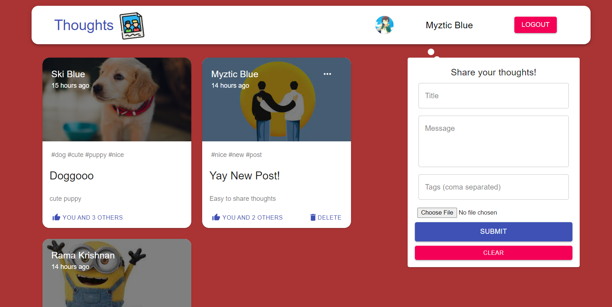

# THOUGHTS APP
Front-end for Thoughts App
 

## Stack used:
- MongoDB
- Express
- ReactJS
- NodeJS
- Redux

## Features:
- Full stack Social Media App (Single Page Application) where you can post your thoughts.
- It uses MongoDB to store data, Redux used as data store.
- Can fetch, create, update, delete posts.
- Likes feature implemented (only LoggedIn Users can like it).
- Authentication done using both <mark>Google Oauth2.0 and JWT</mark>.

## Link:
- [Github repo for Full Application](https://github.com/skiblue3/thoughts-project)
- [Social Media App](https://thoughts-project-03.herokuapp.com/)
- [API](https://thoughts-project-03.herokuapp.com/api/posts/)

